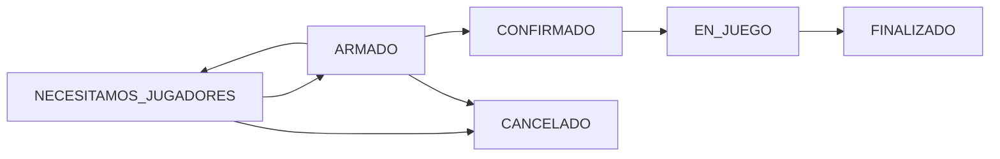

# Backend API - Sistema de Gestión de Partidos Deportivos

Este es el backend de la aplicación desarrollado con Node.js, Express y TypeScript, implementando una arquitectura robusta con patrones de diseño para la gestión de partidos deportivos.

## 🚀 Tecnologías Principales

- **Node.js** con **TypeScript**
- **Express.js** para la API REST
- **PostgreSQL** como base de datos principal
- **Sequelize ORM** para manejo de datos
- **Firebase Cloud Messaging** para notificaciones push
- **JWT Authentication** para seguridad
- **Jest** para testing
- **Node-cron** para tareas programadas
- **Resend** para envío de emails

## 🏗️ Arquitectura y Patrones de Diseño

El proyecto implementa varios patrones de diseño para garantizar escalabilidad y mantenibilidad:

### **Patrón State**

- Gestión de estados de partidos: `NECESITAMOS_JUGADORES` → `ARMADO` → `CONFIRMADO` → `EN_JUEGO` → `FINALIZADO`
- Cada estado encapsula su lógica específica y transiciones válidas
- Implementado en `src/services/partido/estados/`

### **Patrón Observer**

- Sistema de notificaciones automáticas para cambios de estado
- Notificaciones push (Firebase) y email como respaldo
- Observadores configurables en `src/observers/`

### **Patrón Strategy**

- Algoritmos de emparejamiento intercambiables (por zona, nivel, etc.)
- Implementado en `src/services/partido/emparejamiento/estrategias/`

### **Patrón Adapter**

- Adaptadores para diferentes servicios de notificación
- Firebase y Email adapters en `src/services/notificacion/`

## 📋 Prerrequisitos

- **Node.js** (versión 18.x o superior)
- **PostgreSQL** (versión 12 o superior)
- **Cuenta de Firebase** (para notificaciones push)
- **Cuenta de Resend** (para emails)
- **npm** o **yarn**

## 🔧 Instalación

1. **Clonar el repositorio:**

```bash
git clone [URL_DEL_REPOSITORIO]
cd proceso-desarrollo-backend
```

2. **Instalar dependencias:**

```bash
npm install
```

3. **Configurar variables de entorno:**

```bash
cp .env.example .env
```

4. **Configurar base de datos:**

```bash
npm run db:create
npm run db:migrate
npm run db:seed
```

5. **Iniciar en modo desarrollo:**

```bash
npm run dev
```

## 🏃‍♂️ Scripts Disponibles

### **Desarrollo**

- `npm run dev` - Servidor con hot-reload
- `npm run build` - Compilar TypeScript
- `npm start` - Servidor en producción

### **Base de Datos**

- `npm run db:create` - Crear base de datos
- `npm run db:migrate` - Ejecutar migraciones
- `npm run db:seed` - Poblar con datos de prueba
- `npm run db:drop` - Eliminar base de datos

### **Testing**

- `npm test` - Ejecutar tests
- `npm run test:watch` - Tests en modo watch
- `npm run test:coverage` - Reporte de cobertura

### **Utilidades**

- `npm run lint` - Verificar código
- `npm run format` - Formatear código

## 📁 Estructura del Proyecto

```
src/
├── app.ts                      # Punto de entrada de la aplicación
├── testUsuarioService.ts       # Tests de servicios de usuario
├── config/                     # Configuraciones
│   ├── database.ts            # Configuración de Sequelize
│   └── database.cjs           # Configuración CommonJS para migraciones
├── controllers/               # Controladores de rutas HTTP
│   ├── auth/                  # Autenticación y autorización
│   ├── deporte/               # Gestión de deportes
│   ├── health/                # Health checks del sistema
│   ├── partido/               # Gestión de partidos
│   ├── scheduler/             # Control de tareas programadas
│   ├── usuario/               # Gestión de usuarios
│   └── zona/                  # Gestión de zonas geográficas
├── services/                  # Lógica de negocio (se comunica con models)
│   ├── auth/                  # Servicios de autenticación
│   ├── deporte/               # Servicios de deportes
│   ├── health/                # Servicios de salud del sistema
│   ├── notificacion/          # Sistema de notificaciones
│   ├── partido/               # Servicios de partidos
│   │   ├── estados/           # 🎯 Patrón State
│   │   │   ├── EstadoPartido.ts         # Interface base
│   │   │   ├── EstadoFactory.ts         # Factory de estados
│   │   │   ├── NecesitamosJugadores.ts  # Estado inicial
│   │   │   ├── Armado.ts                # Estado equipo completo
│   │   │   ├── Confirmado.ts            # Estado confirmado
│   │   │   ├── EnJuego.ts               # Estado en progreso
│   │   │   ├── Finalizado.ts            # Estado terminado
│   │   │   └── Cancelado.ts             # Estado cancelado
│   │   ├── emparejamiento/    # 🎯 Patrón Strategy
│   │   │   ├── EmparejamientoStrategy.ts    # Interface strategy
│   │   │   ├── EmparejamientoService.ts     # Servicio principal
│   │   │   ├── EmparejamientoPorZona.ts     # Estrategia por zona
│   │   │   ├── EmparejamientoPorNivel.ts    # Estrategia por nivel
│   │   │   └── EmparejamientoPorHistorial.ts # Estrategia por historial
│   │   ├── PartidoService.ts  # Servicio principal de partidos
│   │   └── InvitacionService.ts # Servicio de invitaciones
│   ├── scheduler/             # Tareas programadas (cron jobs)
│   ├── usuario/               # Servicios de usuarios
│   └── zona/                  # Servicios de zonas
├── models/                    # Modelos Sequelize (acceso a datos)
│   ├── index.ts              # Configuración y conexión de modelos
│   ├── usuario.ts            # Modelo de usuarios
│   ├── partido.ts            # Modelo de partidos
│   ├── zona.ts               # Modelo de zonas
│   ├── deporte.ts            # Modelo de deportes
│   └── ...                   # Otros modelos
├── DTOs/                     # Data Transfer Objects
│   ├── UsuarioDTO.ts         # DTO para usuarios
│   ├── PartidoDTO.ts         # DTO para partidos
│   ├── PartidoCreationDTO.ts # DTO para creación de partidos
│   ├── InvitacionDTO.ts      # DTO para invitaciones
│   ├── NotificacionDTO.ts    # DTO para notificaciones
│   ├── DeporteDTO.ts         # DTO para deportes
│   └── ZonaDTO.ts            # DTO para zonas
├── routes/                   # Definición de rutas Express
│   ├── auth/                 # Rutas de autenticación
│   ├── deporte/              # Rutas de deportes
│   ├── partido/              # Rutas de partidos
│   ├── scheduler/            # Rutas de scheduler
│   ├── usuario/              # Rutas de usuarios
│   └── zona/                 # Rutas de zonas
├── middleware/               # Middlewares personalizados
│   ├── authMiddleware.ts     # Middleware de autenticación
│   ├── invitacionValidationMiddleware.ts # Validación de invitaciones
│   └── partidoValidationMiddleware.ts    # Validación de partidos
├── observers/                # 🎯 Patrón Observer
│   ├── PartidoObserver.ts    # Interface observer
│   ├── PartidoSubject.ts     # Subject para notificaciones
│   ├── NotificacionObserver.ts # Observer de notificaciones
│   └── InvitacionObserver.ts   # Observer de invitaciones
├── migrations/               # Migraciones de base de datos
│   ├── 20250529125810-create-zona.cjs
│   ├── 20250529125811-create-deporte.cjs
│   ├── 20250529125812-create-usuario.cjs
│   ├── 20250529125813-create-partido.cjs
│   └── ...                   # Otras migraciones
├── seeders/                  # Datos de prueba (seeders)
└── scripts/                  # Scripts de utilidad

tests/                        # 🧪 Tests del proyecto
├── jest.config.js           # Configuración de Jest
├── setup.ts                 # Setup de tests
├── estado-pattern.test.ts   # Tests del patrón State
├── estado-pattern-unit.test.ts # Tests unitarios State
├── partido.integration.test.ts # Tests de integración
├── test-observer-pattern.js  # Tests del patrón Observer
├── test-integration.ts      # Tests de integración completos
└── ...                      # Otros archivos de test

documentacion/               # 📚 Documentación técnica
├── API_RESPONSE_FORMAT.md   # Formato de respuestas API
├── AUTH_TESTING.md          # Testing de autenticación
├── JWT_SECURITY_IMPLEMENTATION.md # Implementación JWT
├── PARTIDO_API_DOCUMENTATION.md   # Documentación API partidos
├── REFACTORIZACION_STATE_PATTERN_FINAL.md # Refactoring State
└── ...                      # Otras documentaciones

package.json                 # Dependencias y scripts npm
tsconfig.json               # Configuración TypeScript
nodemon.json                # Configuración nodemon
README.md                   # Este archivo
.env                        # Variables de entorno (local)
.gitignore                  # Archivos ignorados por Git
```

## 🌐 API Endpoints
Documentación de los endpoints:
https://bold-seat-a94.notion.site/2028f5cdd2d18120a9f0da3d3a6b0448?v=2028f5cdd2d181229b23000cd142e5f2 

### **Autenticación**

```
POST   /auth/signup           # Registro de usuario
POST   /auth/login            # Inicio de sesión
GET    /auth/protected        # Verificar token
```

### **Partidos**

```
POST   /api/partidos                    # Crear partido
GET    /api/partidos                    # Obtener todos los partidos
GET    /api/partidos/:id                # Obtener partido por ID
GET    /api/partidos/usuario/:userId    # Partidos de un usuario
PUT    /api/partidos/:id/estado         # Cambiar estado
PUT    /api/partidos/:id/ganador        # Establecer equipo ganador
```

### **Invitaciones**

```
GET    /api/invitaciones/usuario/:userId   # Invitaciones de usuario
GET    /api/invitaciones/partido/:partidoId # Invitaciones de partido
PUT    /api/invitaciones/:id/responder     # Responder invitación
```

### **Emparejamiento**

```
POST   /api/emparejamiento/ejecutar      # Ejecutar emparejamiento manual
POST   /api/emparejamiento/automatico    # Emparejamiento automático
```

### **Usuarios, Zonas y Deportes**

```
GET    /api/usuarios          # Listar usuarios
GET    /api/zonas            # Listar zonas
GET    /api/deportes         # Listar deportes
```

## 🔄 Flujo de Estados de Partido



### **Estados y Transiciones:**

- **NECESITAMOS_JUGADORES**: Partido creado, acepta nuevos jugadores
- **ARMADO**: Equipo completo, listo para confirmar
- **CONFIRMADO**: Partido confirmado por organizador
- **EN_JUEGO**: Partido en progreso
- **FINALIZADO**: Partido terminado (con posible equipo ganador)
- **CANCELADO**: Partido cancelado

## 🔔 Sistema de Notificaciones

### **Tipos de Notificación:**

- **Push Notifications** (Firebase Cloud Messaging)
- **Email** (Resend como respaldo)

### **Eventos que Generan Notificaciones:**

- Creación de invitaciones
- Cambios de estado de partido
- Respuestas a invitaciones
- Recordatorios automáticos

## ⏰ Tareas Automáticas

El sistema incluye tareas programadas (cron jobs):

- **Actualización de estados**: Transiciones automáticas basadas en tiempo
- **Emparejamiento automático**: Búsqueda periódica de jugadores
- **Finalización automática**: Partidos que superan su duración
- **Limpieza de datos**: Eliminación de tokens expirados

## 🔒 Seguridad

### **Medidas Implementadas:**

- **JWT Authentication** con expiración configurable
- **Rate Limiting** para prevenir abuso
- **Helmet** para headers de seguridad
- **CORS** configurado para frontend específico
- **Validación** robusta con express-validator
- **Encriptación** de contraseñas con bcryptjs
- **Sanitización** de datos de entrada

## 🧪 Testing

### **Tipos de Tests:**

- **Tests Unitarios**: Lógica de servicios y utilidades
- **Tests de Integración**: API endpoints completos
- **Tests de Patrones**: Verificación de Observer, State, etc.

```bash
npm test                    # Ejecutar todos los tests
npm run test:unit          # Solo tests unitarios
npm run test:integration   # Solo tests de integración
npm run test:coverage      # Reporte de cobertura
```

## 🌍 Variables de Entorno

### **Base de Datos:**

```env
NODE_ENV=development
DB_HOST=localhost
DB_PORT=5432
DB_USER=postgres
DB_PASSWORD=password
DB_NAME=partidos_dev
DATABASE_URL=postgresql://... # Para producción
```

### **Autenticación:**

```env
JWT_SECRET=your-secret-key
JWT_EXPIRES_IN=24h
```

### **Firebase:**

```env
FIREBASE_WEB_PUSH_CERTIFICATE=path/to/firebase-key.json
```

### **Email:**

```env
EMAIL_SERVICE=resend
EMAIL_HOST=smtp.resend.com
EMAIL_USER=your-email
EMAIL_PASSWORD=your-password
```

## 🚀 Despliegue

### **Desarrollo Local:**

```bash
npm run dev
```

### **Producción:**

```bash
npm run build
npm start
```

### **Docker:**

```bash
docker build -t partidos-backend .
docker run -p 3000:3000 partidos-backend
```

## 📊 Monitoreo y Logs

- **Logs estructurados** con niveles configurables
- **Monitoreo de rendimiento** de base de datos
- **Tracking de errores** y excepciones
- **Métricas de uso** de API

## 🤝 Contribución

1. Fork el proyecto
2. Crear rama para feature (`git checkout -b feature/nueva-funcionalidad`)
3. Commit cambios (`git commit -m 'Agregar nueva funcionalidad'`)
4. Push a la rama (`git push origin feature/nueva-funcionalidad`)
5. Abrir Pull Request

## 📄 Licencia

Este proyecto está bajo la Licencia ISC.

## 👥 Equipo

Desarrollado por el equipo de la cátedra de Proceso de Desarrollo de Software.

---

**📝 Nota Importante**: Este sistema opera exclusivamente con **flujo de invitaciones**. Los usuarios NO pueden unirse directamente a partidos, sino que deben ser invitados a través del sistema de emparejamiento automático.
